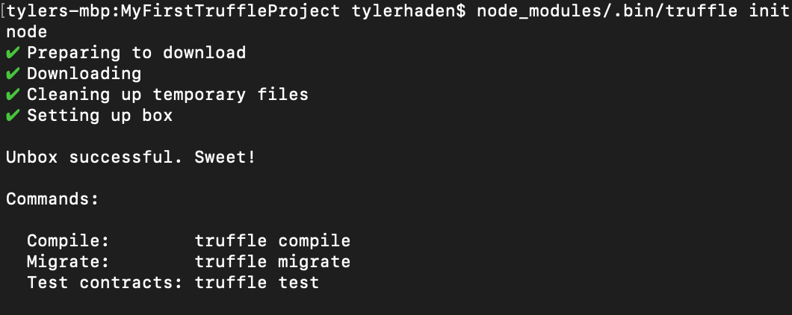

---
authors:
- Tyler John Haden
tags:
- ethereum
- blockchain
- ether
date: 
title: Creating Your First Truffle Project
image: 
---

An introduction on how to get started with a Truffle-based Solidity project. 

# Assumptions
This tutorial will assume that you have experience with basic bash, node, and npm. It will not assume that you know anything about blockchains or Ethereum.

# Dependencies
- node

# Initialization
`mkdir MyFirstTruffleProject && cd MyFirstTruffleProject`

`vi package.json`
```json
{
  "name": "my-first-truffle-project",
  "version": "0.0.1",
  "description": "",
  "main": "truffle-config.js",
  "directories": {
    "test": "test"
  },
  "repository": {
    "type": "git",
    "url": ""
  },
  "author": "",
  "license": "UNLICENSED",
  "dependencies": {
    "truffle": "^5.0.0"
  }
}
```

`npm install`

`node_modules/.bin/truffle init`

Technically you now have a truffle project! But lets make it better...

# Adding a development network (local blockchain)

`npm install ganache-cli concurrently truffle-hdwallet-provider --save`

package.json
```
{
  ...
  
  "scripts": {
    "start": "concurrently \"npm run ganache\" \"npm run truffle:local\"",
    "test": "concurrently \"npm run ganache\" \"npm run truffle:local && truffle test\" --kill-others --success first",
    "ganache": "ganache-cli --networkId $npm_package_config_ganache_networkId --allowUnlimitedContractSize --gasLimit $npm_package_config_ganache_gasLimit --mnemonic \"$MNEMONIC\"",
    "truffle:local": "rm -rf build && truffle migrate --reset --compile-all --network development"
  },
  "config": {
    "ganache": {
      "networkId": 3431,
      "gasPrice": 25000000000,
      "gasLimit": 6500000
    }
  },
  
  ...
}
```

truffle-config.js
```
var HDWalletProvider = require('truffle-hdwallet-provider');


// environment variables set in the package config
var networkId = process.env.npm_package_config_ganache_networkId;
var gasPrice = process.env.npm_package_config_ganache_gasPrice;
var gasLimit = process.env.npm_package_config_ganache_gasLimit;

// environment variables not set in the package config
var mnemonic = process.env.MNEMONIC;

// naive environment assertions, since these aren't present by default
if (mnemonic === undefined) {
    throw new Error('truffle-config.js needs the environment variable "MNEMONIC"');
} else if (mnemonic.split(' ').length != 12) {
    throw new Error('The environment variable "MNEMONIC" must be 12 words (space delineated)');
}


var truffleConfig = {
  networks: {
    development: {
      host: '127.0.0.1',  // ganache defaults
      port: 8545,         // ganache defaults
      network_id: networkId,
      gas: gasLimit,
      gasPrice: gasPrice,
      // use the local ganache and the mnemonic to generate our main address
      from: (new HDWalletProvider(mnemonic, "http://127.0.0.1:8545")).getAddress(0)
    }
  },
  solc: {
      optimizer: {
          enabled: true,
          runs: 200
      }
  }
};

console.info('\nSetting Truffle Configuration:\n', truffleConfig, '\n');
module.exports = truffleConfig;
```

set mnemonic
`export MNEMONIC="afraid scale shrug order wagon just banner shine solution inflict fluid bid"`

test it by running
`npm run test`

Now we have our own local blockchain every time we want to test it.

# Adding a little bit of contract code, and tests

`npm install truffle-test-utils --save`

Let's add some contract code..

contracts/MyFirstContract.sol -->
```solidity
pragma solidity ^0.5.0;

contract MyFirstContract {
    uint32 public myFirstContractField;

    constructor() {
        myFirstContractField = 123;
    }
}
```

test/1_deployment.js -->
```
require('truffle-test-utils').init();

const MyFirstContract = artifacts.require('MyFirstContract');

const MAX_DEPLOYED_BYTECODE_SIZE = 24576;


contract('MyFirstContract', (accounts) => {

    let myFirstContract;

    // build up and tear down a new MyFirstContract before each test
    beforeEach(async () => {
        myFirstContract = await MyFirstContract.deployed();
    });

    it('has a validated contract size', async () => {
        // bytecode is in hexadecimal, where each byte is represented by two characters: 0x00 -> 0xff
        let bytecodeSize = myFirstContract.constructor._json.bytecode.length / 2;
        let deployedBytecodeSize = myFirstContract.constructor._json.deployedBytecode.length / 2;

        console.info('MyFirstContract deployed at address: ' + web3.utils.toChecksumAddress(myFirstContract.address))
        console.info(' -- size of bytecode in bytes = ', bytecodeSize);
        console.info(' -- size of deployed in bytes = ', deployedBytecodeSize);
        console.info(' -- initialisation and constructor code in bytes = ', bytecodeSize - deployedBytecodeSize);

        // Make assertion on deployed since the initial transaction takes constructor bytecode into account
        assert(deployedBytecodeSize <= MAX_DEPLOYED_BYTECODE_SIZE, 'Contract bytecode is too big to deploy!');
    });

    it('has the correct myFirstContractField set', async () => {
        assert.equal(123, await myFirstContract.myFirstContractField({ from: accounts[0] }),
            'MyFirstContract did not initialize myFirstContractField properly!');
    });

});
```

`npm run test`
yay


# connecting infura

do all the infura.io things and get a project id

`export INFURA_PROJECT_ID=asdf1234`


***
***

- truffle
  - `npm install -g truffle`
    - [documentation](https://truffleframework.com/docs/truffle/getting-started/installation)
    - [npm package](https://www.npmjs.com/package/truffle)

Ensure you have the correct dependency versions:


# Initializations
- `truffle init`
  - [documentation](https://truffleframework.com/docs/truffle/reference/truffle-commands#init)

Create a new directory for your project, and cd into it.
Run `truffle init` inside your project's directory to generate some needed paths, and a config file.


Ensure your project directory looks like this:

